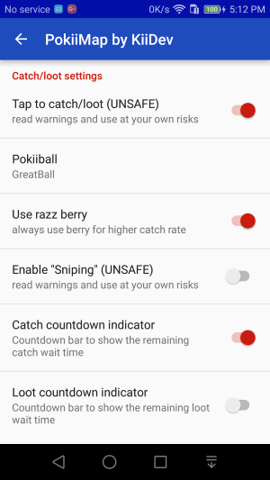
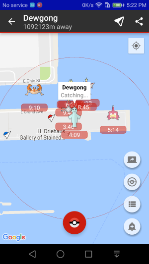
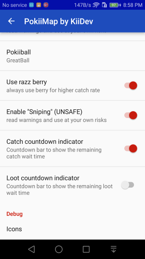
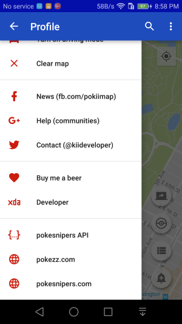
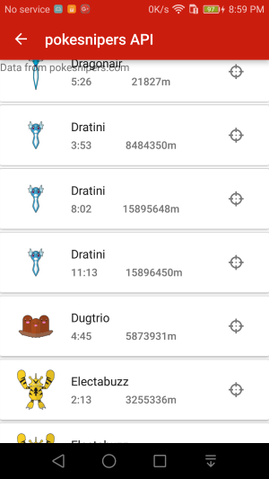
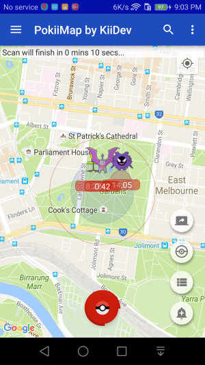

Catch/Loot/Sniping
===============

It's easy to catch/loot in PokiiMap, just tap on a pokemon or a pokestop and then tap the info bubble to catch/loot.

When you catch/loot, it will use your primary account to perform the action. This is considered an UNSAFE action on your primary account. 

UNSAFE warning
---------------

Depending on how you use it, your account may get flagged for cheating. To catch/loot in PokiiMap, you will need first enable it first in setting.

When you catch and loot, PokiiMap spoofs your location to be next to the Pokemon and Pokestop. This "fake" location is sent to the server and may triggered
a `softe ban`_ . Spoofing your locations from 1 location to another location is known as `teleporting`_ , if you teleport too much and too far, it's obvious to 
the server that you are using a tool to change your location.

Sniping
---------------

See `sniping`_ about what sniping is. In PokiiMap, you can enable "sniping" in setting. Read the warning (and just ignore it ;) ) . Once sniping is enabled (safe mode is OFF) , you will see extra options from the slide out drawer to give you spawn locations of rare pokemons. Normally if you just go to that pokemon location with GPS spoof, you will immediately get a `soft ban`_ . When sniping is turned on, PokiiMap helps you spoof your location so that you don't get soft ban when you catch the pokemon. 

