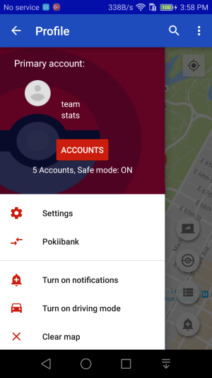
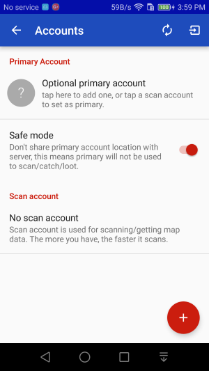
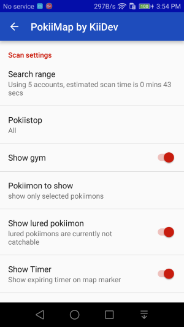
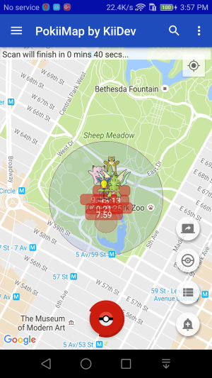
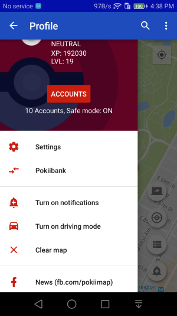
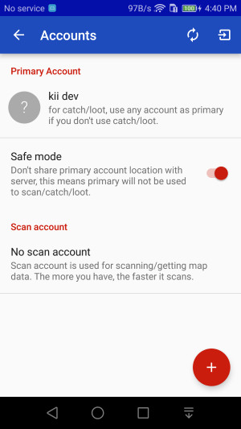

Getting Started
===============

This document will show you how to get up and running with PokiiMap.

Accounts
---------------

Before PokiiMap can scan for pokemons, you will need to add some accounts to PokiiMap. 
There are 2 types of accounts you can add, "Primary Account" and "Scan Account"

*You must have at least 1 account to scan*

	

Primary Account
~~~~~~~~~~~~~~~~~~~

Primary account is optional, you don't need to add one if you just want to scan for pokemons.
If you want to use the `PokiiBank`_ feature, or `catch/loot`_ , then you will need to 
add a primary account to use them.

.. _`catch/loot`: catch_loot.html
.. _`PokiiBank`: pokiibank.html

.. _`scan accounts`:

Scan account
~~~~~~~~~~~~~~~~~~~

Scan account is only used for scanning, each scan can only scan a 70m radius every 10 seconds. You only need to add 1 account to scan, but if you want faster scanning, you may want to add more. 

You can configure the *search range* in PokiiMap's setting, increasing the step also increases the time it will 
take to complete a scan. Each step widens the search range by 140m, for example, search range of 2 means a radius of 210m, search range of
3 means a radius of 350m, and so on...

.. _`scanning`:

Scanning
---------------

After adding the accounts to PokiiMap, you can go back to the map screen, move the map to a location where you want to scan, and press the scan button to start.

Scan time
~~~~~~~~~~~~~~~~~~~

When you change the search range in setting, you will see the estimated scan time in the setting. The more scan accounts you have, the faster the scan can complete.

If you have 2 accounts, the scan time will be cut in 1/2, 3 accounts will cut scan time in 1/3, and so on... The recommended number of scan accounts is between 5 to 10 to get a good scan speed. 

	

Account safety
---------------

PokiiMap has a safe mode feature to ensure maxium safety of your primary account. When you turn on "Safe mode" (ON by default), you primary account will only
be used for _PokiiBank and nothing else. This is as safe as a 3rd party scanner can be at this time.

