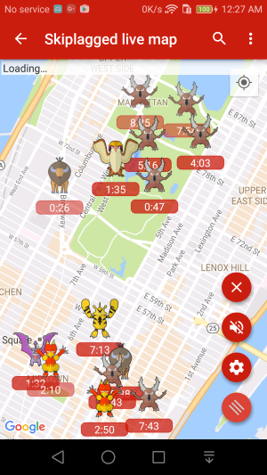
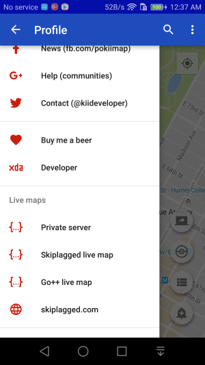
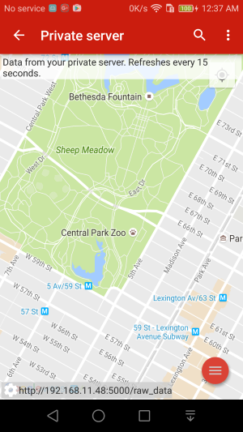
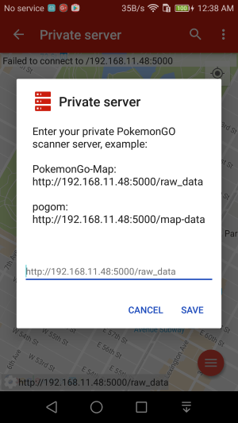

Live Map
===============

Since version 1.5.0, PokiiMap has feature to show pokemons in a live map. There's no need to press the scan button because the scanning happens on a server somewhere else (instead of scanning from the phone). 

You can either connect the live map to your own server or use one of the provided ones. Obvisouly it's more work to setup your own server but your own server will be much more accurate because the other live maps only work in major cities. Pro-tips: select only the pokemons you want to see otherwise there will be too much data on the map.

In the live map, you can also enable notification sounds when a new pokemon of interests show up. 

Private server
---------------

If you know enough to run your own private scanning server, I would expect you can understand how to connect to your own server. 

PokiiMap supports both `[PokemonGo-Map]`_ and `[Pogom]`_ server. PokemonGo-Map server is currently preferred because it allows filtered by a lat/lng bound which is very beneficial when the server has a lot of data.

Use the "Private server" option from the slide out drawer to go to the private live map screen. Press the button at the bottom to enter the address of your server.

**Warning**: "localhost:5000" or "127.0.0.1:5000" are hardware address so it will not work !

To find your address look at this : http://bit.ly/2aweVR1 (if you have a local server) and http://bit.ly/1dWVBmR (if you want to remote server).

PokiiMap will not have any options to help you set up the private server, you will need to read the PokemonGo-Map or Pogom documentations to find out how to set up the server. Here is a short guide for `PokemonGo-Map`_

.. _`PokemonGo-Map`: https://github.com/kiideveloper/PokemonGo-Map/blob/develop/docs/extras/pokiimap.md
.. _`[PokemonGo-Map]`: https://github.com/PokemonGoMap/PokemonGo-Map
.. _`[Pogom]`: https://github.com/favll/pogom

