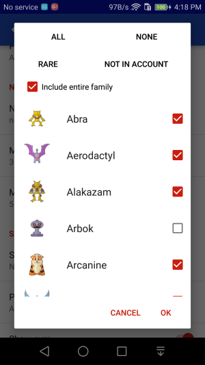
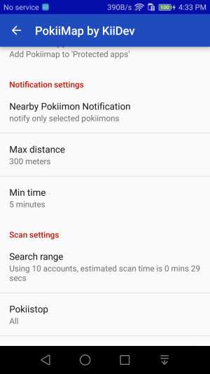
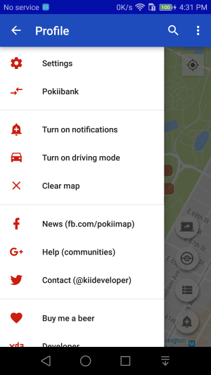
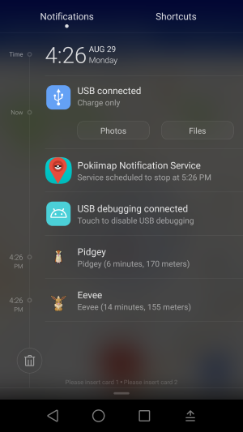

Get notifications
===============

You don't need to keep scanning in PokiiMap to find out if a pokemon that you are interested in is nearby. You can turn on the notification function to 
let PokiiMap run in the background. It scans your current location every 2 minutes and will send a notification to your phone when it detects a pokemon near you.

Notifications settings
---------------

In order to get notifications, you need to select the pokemons you want to be notified about, otherwise you will get a lot of unwanted notifications. 

Go to settings, change the notification settings to what you like.

	

Getting notified
---------------

After changing the notification settings, go back to the map screen and turn the notifications by clicking the notification button.

	

