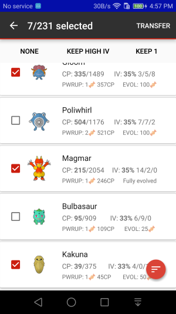

PokiiBank
===============

PokiiBank shows what pokemons you have in your account. It only shows the pokemons in your primary account. 

Check IVs
---------------

See the `IV`_ of the pokemons in your inventories

.. image:: _static/img/pokiibank.png

.. _IV: http://pokemon.wikia.com/wiki/Individual_Values

Mass Transfer
---------------

In PokiiBank, you can also select the pokemons you *don't* want and release them. This is the same 'transfer' function in the game, 
you transfer the pokemons in exchange for pokemons candies

